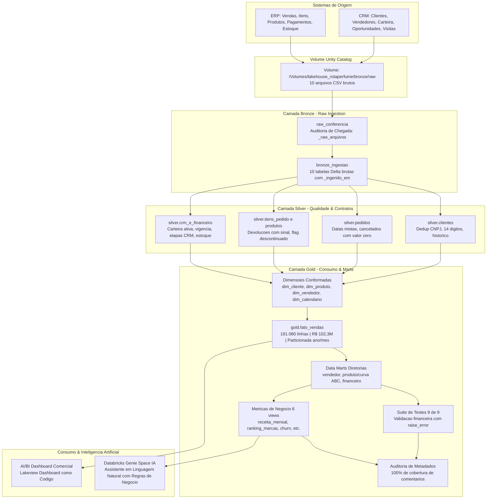

# 🌸 LakeHouse Rota do Perfume — Engenharia de Dados & IA no Databricks

[](https://databricks.com/)
[](https://docs.databricks.com/data-governance/unity-catalog/index.html)
[](https://delta.io/)
[](https://python.org/)
[](https://docs.astral.sh/uv/)
[-0288D1)](https://docs.databricks.com/dev-tools/bundles/index.html)
[](https://docs.databricks.com/dashboards/index.html)
[-4CAF50)](https://docs.databricks.com/genie/index.html)

> Projeto de engenharia de dados e inteligência artificial desenvolvido de ponta a ponta na **Imersão Jornada de Dados**, implementando uma arquitetura **Lakehouse Medallion** moderna no **Databricks** com infraestrutura declarativa via **Databricks Asset Bundles (DAB)**, governança no **Unity Catalog**, dashboards analíticos e assistente de IA em linguagem natural (**Genie Space**).

---

## 📌 1. O Negócio — Rota do Perfume

A **Rota do Perfume** é uma distribuidora B2B brasileira especializada em perfumaria árabe de nicho (importação de casas como *Layali*, *Bayt Al Oud*, *Mizan*, *Zahir* e *Rihan*). Atende canais como perfumarias especializadas, redes de farmácias, quiosques, lojas de departamento e revendedoras autônomas.

### 📊 Números de Referência da Base Histórica (24 Meses: Set/2024 a Ago/2026)
* **Receita Bruta / Líquida Faturada**: **R$ 102.303.828,05**
* **Margem Bruta Total**: **R$ 41.125.619,86** (Margem média de ~40,2%)
* **Base de Clientes Únicos**: **3.000 clientes** ativos no catálogo
* **Volume Transacionado**: **28.729 pedidos** e **197.724 itens de linha**
* **Ticket Médio por Pedido**: **R$ 3.683,67**

### 🧠 Peculiaridades Cruciais do Setor
1. **Sazonalidade Invertida (Reposição Antecipada)**: Por vender no atacado para o varejo, o pico de compras da distribuidora ocorre sempre no **mês anterior** à data comemorativa:
   * **Abril**: Pico de reposição para o *Dia das Mães* (maio).
   * **Junho**: Pico de vendas para o *Dia dos Namorados*.
   * **Outubro**: Pico de abastecimento para a *Black Friday* (novembro).
   * **Dezembro e Janeiro**: Período de **VALE** (comportamento saudável e esperado; o varejo está liquidando estoque).
2. **Impacto Crítico da Ruptura de Estoque**: Em perfumaria de nicho, a falta de um perfume de alta demanda não migra a venda para outro item; a venda simplesmente desaparece.
3. **Disparidade Estratégica de Margens**: *Óleo Concentrado* possui margem alta de **49,9%**, enquanto *Kit Presente* gera grande volume com margem menor de **33,0%**.

---

## 🏛️ 2. Arquitetura Lakehouse Medallion

Todo o pipeline opera sob o catálogo `lakehouse_rotaperfume` no **Unity Catalog** em ambiente **Databricks Serverless Starter Warehouse**, sem dependência de clusters dedicados.



---

## ⚙️ 3. Pipeline de Orquestração Automatizado (12 Tarefas)

O workflow completo é gerenciado pelo Databricks Asset Bundle no job **`rotaperfume_pipeline`**:

| Ordem | Tarefa | Tipo | Papel no Pipeline |
|:---:|---|:---:|---|
| **1** | `raw_conferencia` | Notebook | Confere tamanho e contagem de linhas dos 10 CSVs no Volume, gravando `bronze._raw_arquivos`. |
| **2** | `bronze_ingestao` | Notebook | Ingestão pura dos 10 CSVs em Delta (`inferSchema=false`), validando integridade de linhas. |
| **3** | `silver_clientes` | SQL Task | Normalização de CNPJ (14 dígitos), deduplicação por CNPJ e preservação de duplicatas em array. |
| **4** | `silver_pedidos` | SQL Task | Resolução de formatos mistos de data (ISO / pt-BR), flags de cancelamento e valor líquido. |
| **5** | `silver_itens_e_produtos` | SQL Task | Preservação de devoluções (quantidade negativa) e mapeamento de SKUs descontinuados. |
| **6** | `silver_crm_e_financeiro` | SQL Task | Carteira com vendedor desligado (`orfao_vendedor_desligado`), funil de vendas e recálculo de ruptura. |
| **7** | `gold_dimensoes` | SQL Task | Criação das dimensões conformadas `dim_cliente`, `dim_produto`, `dim_vendedor` e `dim_calendario`. |
| **8** | `gold_fato_vendas` | SQL Task | Tabela fato granular no nível de item de pedido, particionada por `(ano, mes)`. |
| **9** | `gold_marts` | SQL Task | Geração dos data marts para diretoria comercial, de produtos (com Curva ABC) e financeira. |
| **10** | `testes` | SQL Task | Execução de 9 testes de integridade financeira e regras de negócio com aborto via `raise_error()`. |
| **11** | `metricas_de_negocio` | SQL Task | Criação de 6 views semânticas para consumo direto por BI e agentes de IA. |
| **12** | `auditoria_de_metadado` | SQL Task | Validação contra `information_schema` exigindo 100% de documentação em tabelas e colunas. |

---

## 🛡️ 4. Governança, Qualidade e Contratos de Dados

### A. Contratos Formais na Camada Silver (`CHECK` Constraints)
* `silver.clientes`: `length(cnpj) = 14` e `data_cadastro IS NOT NULL`
* `silver.pedidos`: `data_pedido IS NOT NULL` e `NOT cancelado OR valor_liquido = 0`
* `silver.itens_pedido`: `quantidade_abs > 0`

### B. Suíte de 9 Testes Automatizados na Gold
1. **Reconciliação Exata**: Receita da Gold = Receita da Silver = **R$ 102.303.828,05** (tolerância R$ 0,01).
2. **Unicidade de CNPJ**: 0 CNPJs duplicados em `silver.clientes`.
3. **Completude Temporal**: Nenhuma `data_pedido` nula.
4. **Tratamento de Devoluções**: Receita negativa restrita a itens com `devolucao = true`.
5. **Volume de Linhas**: `gold.fato_vendas` entre 140k e 250k linhas (obtido: **191.080**).
6. **Integridade de Pedidos**: 0 pedidos órfãos.
7. **Integridade de Clientes**: 0 clientes órfãos.
8. **Reconciliação do Mart de Produtos**: Soma do `mart_produto_performance` = `fato_vendas`.
9. **Formato de CNPJ**: 100% dos CNPJs com 14 dígitos numéricos.

### C. Auditoria de Metadados para IA
* Consulta automatizada ao `information_schema`.
* **100% de cobertura de comentários** em todas as tabelas, views e colunas do fato e views semânticas.

---

## 🤖 5. Camada de Consumo: Dashboard & IA como Código

### 📊 Dashboard Comercial (Databricks AI/BI Lakeview)
O dashboard é declarado em [`rotaperfume/resources/dashboard-comercial.lvdash.json`](rotaperfume/resources/dashboard-comercial.lvdash.json) e implantado automaticamente no deploy do bundle:
* **4 KPIs no Topo**: Receita (R$ 102,3M), Margem (R$ 41,1M), Pedidos (27,8K) e Ticket Médio (R$ 3.683,67) via `MEASURE()`.
* **Filtros Globais**: `Ano`, `Segmento` e `Cidade` com cross-filtering dinâmico.
* **Linha de Sazonalidade (24 Meses)**: Análise temporal destacando picos e vales do setor.
* **Análise de Portfólio**: Ranking de marcas por faturamento e margem % por categoria (*Kit Presente* 33% vs *Óleo Concentrado* 50%).
* **Ranking de Clientes**: Tabela dos Top 20 compradores.

🔗 **[Acessar Dashboard Publicado](https://dbc-61d9738c-00ad.cloud.databricks.com/dashboardsv3/01f1a19de456132680fd58ff4302a5c2/published?w=111196643652189)**

---

### 🧠 Databricks Genie Space (Assistente de IA em Linguagem Natural)
O espaço do Genie é versionado em [`rotaperfume/resources/comercial.geniespace.json`](rotaperfume/resources/comercial.geniespace.json) e [`rotaperfume/resources/genie.genie_space.yml`](rotaperfume/resources/genie.genie_space.yml):
* **Contexto de Negócio Embutido**: Regras de cálculo, sazonalidade antecipada e glossário técnico.
* **Perguntas Pré-Calibradas**:
  * *"Dezembro foi um mês ruim?"* ➔ O Genie explica que Dezembro é vale normal do setor.
  * *"Quanto da receita vem dos produtos recém-lançados?"* ➔ Consulta `efeito_lancamento`.
  * *"Quais clientes pararam de comprar e quanto perdemos por mês?"* ➔ Consulta `clientes_em_risco`.
  * *"Qual categoria vende muito e ganha pouco?"* ➔ Consulta `margem_por_categoria`.

🔗 **[Acessar Genie Space de IA](https://dbc-61d9738c-00ad.cloud.databricks.com/genie/rooms/01f1a19fc09b1d0e8618ce1425f7dffc?w=111196643652189)**

---

## 📂 6. Estrutura do Repositório

```
LakeHousePerfumes/
├── dados/                               # Datasets brutos gerados com seed 42
│   ├── crm/                             # CSVs: clientes, vendedores, carteira, oportunidades, visitas
│   └── erp/                             # CSVs: produtos, pedidos, itens_pedido, pagamentos, estoque
├── rotaperfume/                         # Databricks Asset Bundle (DAB)
│   ├── databricks.yml                   # Configuração global do Bundle e targets (dev/prod)
│   ├── resources/                       # Recursos declarativos como código
│   │   ├── catalogo.yml                 # Schemas (bronze/silver/gold) e Volume (bronze.raw)
│   │   ├── pipeline.job.yml             # Workflow DAG com as 12 tarefas
│   │   ├── dashboard.dashboard.yml      # Recurso do Dashboard Lakeview
│   │   ├── dashboard-comercial.lvdash.json # Definição visual do Lakeview Dashboard
│   │   ├── genie.genie_space.yml        # Recurso do Genie Space (IA)
│   │   └── comercial.geniespace.json    # Configuração e instruções do Genie Space
│   ├── src/                             # Código-fonte das transformações
│   │   ├── raw/                         # Notebook e lib de conferência de arquivos
│   │   ├── bronze/                      # Notebook e lib de ingestão crua para Delta
│   │   └── gold/                        # Scripts SQL: dimensões, fato, marts, testes, views e auditoria
│   │       ├── 05-dimensoes.sql
│   │       ├── 06-fato-vendas.sql
│   │       ├── 07-marts.sql
│   │       ├── 08-testes.sql
│   │       ├── 09-metricas-negocio.sql
│   │       └── 10-auditoria-metadado.sql
│   ├── scripts/                         # Scripts bash para setup inicial do catálogo e upload raw
│   │   ├── criar-catalogo.sh
│   │   └── subir-raw.sh
│   ├── docs/                            # Documentação técnica e instruções de negócio para IA
│   │   └── genie-instrucoes.md
│   └── tests_unit/                      # Testes unitários com pytest para libs puras de conferência/ingestão
└── pyproject.toml                       # Dependências do projeto gerenciadas via uv (Python 3.12)
```

---

## 🚀 7. Como Reproduzir e Executar o Projeto

### Pré-requisitos
* Python 3.12 (evite Python 3.13)
* [uv](https://docs.astral.sh/uv/) instalado
* [Databricks CLI](https://docs.databricks.com/dev-tools/cli/databricks-cli.html) (versão 0.205+)
* Conta no Databricks (Databricks Free Edition ou Workspace corporativo)

### Passo a Passo

1. **Clonar o Repositório e Configurar o Ambiente**:
   ```bash
   git clone https://github.com/oemeferreira/LakeHousePerfumes.git
   cd LakeHousePerfumes/rotaperfume
   uv sync --dev
   ```

2. **Autenticar na Databricks CLI**:
   ```bash
   databricks auth login --host https://SEU-WORKSPACE.cloud.databricks.com
   ```

3. **Criar o Catálogo e Subir os Dados Brutos**:
   ```bash
   bash scripts/criar-catalogo.sh Emerson
   bash scripts/subir-raw.sh Emerson
   ```

4. **Validar e Fazer o Deploy do Bundle**:
   ```bash
   databricks bundle validate --target dev --profile Emerson
   databricks bundle deploy --target dev --profile Emerson
   ```

5. **Executar o Pipeline Completo**:
   ```bash
   databricks bundle run rotaperfume_pipeline --target dev --profile Emerson
   ```

6. **Rodar os Testes Unitários Locais**:
   ```bash
   uv run pytest tests_unit/ --basetemp=./.pytest_tmp
   ```

---

## 👨‍💻 Autor

Desenvolvido por **Emerson Ferreira** no contexto da **Imersão Jornada de Dados + IA**.