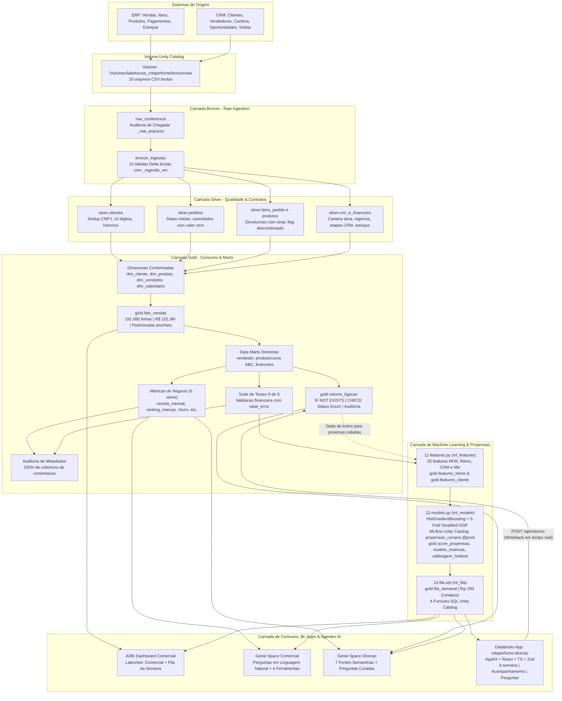

# 🌸 LakeHouse Rota do Perfume — Engenharia de Dados, Machine Learning, Databricks Apps & Agentes de IA

[](https://databricks.com/)
[](https://rotaperfume-direcao-111196643652189.aws.databricksapps.com)
[](https://docs.databricks.com/data-governance/unity-catalog/index.html)
[](https://delta.io/)
[](https://mlflow.org/)
[](https://scikit-learn.org/)
[](https://react.dev/)
[](https://python.org/)
[](https://docs.astral.sh/uv/)
[-0288D1)](https://docs.databricks.com/dev-tools/bundles/index.html)
[](https://docs.databricks.com/dashboards/index.html)
[-4CAF50)](https://docs.databricks.com/genie/index.html)

> Projeto completo de engenharia de dados, machine learning, inteligência artificial e aplicação full-stack desenvolvido de ponta a ponta na **Imersão Jornada de Dados**, implementando uma arquitetura **Lakehouse Medallion** moderna no **Databricks** com infraestrutura declarativa via **Databricks Asset Bundles (DAB)**, governança no **Unity Catalog**, modelos de propensão de compra registrados no **MLflow**, dashboards analíticos, agentes conversacionais em linguagem natural (**Genie Spaces**) e um **Databricks App** operacional com loop de feedback em tempo real.

---

## 📌 1. O Negócio — Rota do Perfume

A **Rota do Perfume** é uma distribuidora B2B brasileira especializada em perfumaria árabe de nicho (importação de casas como *Layali*, *Bayt Al Oud*, *Mizan*, *Zahir* e *Rihan*). Atende canais como perfumarias especializadas, redes de farmácias, quiosques, lojas de departamento e revendedoras autônomas.

### 📊 Números de Referência da Base Histórica (24 Meses: Set/2024 a Ago/2026)
* **Receita Bruta / Líquida Faturada**: **R$ 102.303.828,05**
* **Margem Bruta Total**: **R$ 41.125.619,86** (Margem média de ~40,2%)
* **Base de Clientes Únicos**: **3.000 clientes** ativos no catálogo
* **Volume Transacionado**: **28.729 pedidos** e **197.724 itens de linha**
* **Ticket Médio por Pedido**: **R$ 3.683,67**

### 🧠 Peculiaridades Cruciais do Setor
1. **Sazonalidade Invertida (Reposição Antecipada)**: Por vender no atacado para o varejo, o pico de compras da distribuidora ocorre sempre no **mês anterior** à data comemorativa:
   * **Abril**: Pico de reposição para o *Dia das Mães* (maio).
   * **Junho**: Pico de vendas para o *Dia dos Namorados*.
   * **Outubro**: Pico de abastecimento para a *Black Friday* (novembro).
   * **Dezembro e Janeiro**: Período de **VALE** (comportamento saudável e esperado; o varejo está liquidando estoque).
2. **Impacto Crítico da Ruptura de Estoque**: Em perfumaria de nicho, a falta de um perfume de alta demanda não migra a venda para outro item; a venda simplesmente desaparece.
3. **Disparidade Estratégica de Margens**: *Óleo Concentrado* possui margem alta de **49,9%**, enquanto *Kit Presente* gera grande volume com margem menor de **33,0%**.

---

## 🏛️ 2. Arquitetura Lakehouse Medallion, ML & Loop de Feedback

Todo o pipeline opera sob o catálogo `lakehouse_rotaperfume` no **Unity Catalog** em ambiente **Databricks Serverless Starter Warehouse**, sem dependência de clusters dedicados. 

O diferencial arquitetural do projeto é o **loop de feedback operacional fechado**: o modelo de ML prioriza os 200 contatos semanais; o **Databricks App** entrega a fila aos vendedores e grava o desfecho das ligações diretamente na tabela Delta `gold.retorno_ligacao` via Databricks Statement Execution API, retroalimentando as próximas rodadas de treino.



---

## ⚙️ 3. Pipeline de Orquestração Automatizado (16 Tarefas)

O workflow completo é gerenciado pelo Databricks Asset Bundle no job **`rotaperfume_pipeline`**:

| Ordem | Tarefa | Tipo | Depende de | Papel no Pipeline |
|:---:|---|:---:|:---:|---|
| **1** | `raw_conferencia` | Notebook | — | Confere tamanho e contagem de linhas dos 10 CSVs no Volume, gravando `bronze._raw_arquivos`. |
| **2** | `bronze_ingestao` | Notebook | `raw_conferencia` | Ingestão pura dos 10 CSVs em Delta (`inferSchema=false`), validando integridade de linhas. |
| **3** | `silver_clientes` | SQL Task | `bronze_ingestao` | Normalização de CNPJ (14 dígitos), deduplicação por CNPJ e preservação de duplicatas em array. |
| **4** | `silver_pedidos` | SQL Task | `bronze_ingestao` | Resolução de formatos mistos de data (ISO / pt-BR), flags de cancelamento e valor líquido. |
| **5** | `silver_itens_e_produtos` | SQL Task | `bronze_ingestao` | Preservação de devoluções (quantidade negativa) e mapeamento de SKUs descontinuados. |
| **6** | `silver_crm_e_financeiro` | SQL Task | `bronze_ingestao` | Carteira com vendedor desligado (`orfao_vendedor_desligado`), funil de vendas e recálculo de ruptura. |
| **7** | `gold_dimensoes` | SQL Task | `silver_*` (4 tasks) | Criação das dimensões conformadas `dim_cliente`, `dim_produto`, `dim_vendedor` e `dim_calendario`. |
| **8** | `gold_fato_vendas` | SQL Task | `gold_dimensoes` | Tabela fato granular no nível de item de pedido, particionada por `(ano, mes)`. |
| **9** | `gold_marts` | SQL Task | `gold_fato_vendas` | Geração dos data marts para diretoria comercial, de produtos (com Curva ABC) e financeira. |
| **10** | `gold_retorno_ligacao` | SQL Task | `gold_marts` | Tabela Delta `gold.retorno_ligacao` (`IF NOT EXISTS` e `CHECK` constraint), preservando o histórico de ligações gravado pelo app. |
| **11** | `testes` | SQL Task | `gold_marts` | Execução de 9 testes de integridade financeira e regras de negócio com aborto via `raise_error()`. |
| **12** | `metricas_de_negocio` | SQL Task | `gold_marts` | Criação de 6 views semânticas para consumo direto por BI, Apps e agentes de IA. |
| **13** | `auditoria_de_metadado` | SQL Task | `testes`, `metricas_de_negocio` | Validação contra `information_schema` exigindo 100% de documentação em tabelas e colunas. |
| **14** | `ml_features` | Notebook | `testes` | Engenharia de 20 features comportamentais gerando `gold.features_treino` (alvo 7d) e `gold.features_cliente`. |
| **15** | `ml_modelo` | Notebook | `ml_features` | Treino `HistGradientBoosting`, 3 asserts, registro no MLflow UC (`@prod`) e escoragem (`gold.score_propensao`). |
| **16** | `ml_fila` | SQL Task | `ml_modelo` | Geração de `gold.fila_semanal` (200 contatos com motivo e estoque), 4 ferramentas SQL e 3 testes `raise_error`. |

---

## 🔮 4. Ciência de Dados & Machine Learning em Produção

A camada de Machine Learning resolve a pergunta fundamental da Diretoria Comercial:
> *"Tenho 3.000 clientes. O time consegue ligar para 200 por semana. Quais 200 acionar para maximizar o retorno?"*

### A. Engenharia de Features (20 Variáveis em 4 Grupos)
Calculadas a partir de uma única função `montar_features(referencia)` com corte temporal estrito `< referencia` para **eliminar data leakage**:
* **RFM (6)**: `recencia_dias`, `frequencia_pedidos`, `valor_total`, `ticket_medio`, `margem_total`, `margem_percentual`.
* **Ritmo (4)**: `intervalo_medio_dias`, `desvio_intervalo_dias`, `atraso_relativo` (com proteção para clientes de 1 pedido), `pedidos_ultimos_90d`.
* **CRM (5)**: `oportunidades_abertas`, `oportunidades_ganhas`, `taxa_ganho`, `visitas_90d`, `conversao_visita`.
* **Mix (5)**: `skus_distintos`, `categorias_distintas`, `marcas_distintas`, `concentracao_marca_top`, `comprou_lancamento`.

### B. Treinamento & Validação do Modelo
* **Algoritmo**: `HistGradientBoostingClassifier(random_state=42)` do scikit-learn (tratamento nativo de NaNs e execução Serverless leve).
* **Validação Cruzada Out-of-Fold (5 Folds)**: Mede o impacto financeiro e métricas de negócio (**`lift_top200`** e **`acertos_top200`**) contra a taxa base de **10,1%**.
* **3 Asserts que Interrompem o Pipeline em Caso de Falha**:
  1. Ganho de AUC sobre o melhor baseline heurístico >= **+0,05**.
  2. AUC < **0,99** (proteção contra data leakage).
  3. `lift_top200` >= **2,5x** (viabilidade econômica garantida).
* **Registro no Unity Catalog**: `lakehouse_rotaperfume.gold.propensao_compra` com alias `@prod` e inferência de assinatura.

### C. A Fila Semanal & 4 Ferramentas no Unity Catalog
* **`gold.fila_semanal`**: 200 clientes com maior propensão entre vendedores ativos, balanceados por vendedor, com `motivo` explicativo dinâmico e `sugestao` de recompra com consulta ao snapshot mais recente de estoque.
* **4 Funções SQL de Ferramentas para Agentes de IA**:
  1. `gold.priorizar_carteira(p_vendedor, p_quantos)`: Fatia da fila do vendedor.
  2. `gold.contexto_cliente(p_cliente_id)`: Perfil consolidado e marcas favoritas.
  3. `gold.sugerir_produtos(p_cliente_id)`: SKUs favoritos parados há mais de 90 dias.
  4. `gold.checar_disponibilidade(p_sku)`: Saldo e flag de ruptura no estoque.

---

## 📱 5. Databricks App: `rotaperfume-direcao` (Full-Stack & Feedback Loop)

Aplicação corporativa moderna hospedada diretamente no Databricks Apps, construída com **Databricks AppKit 0.57**, **React 19**, **TypeScript**, **Tailwind CSS**, **Radix UI** e **Express**.

🔗 **[Acessar Databricks App no Ar](https://rotaperfume-direcao-111196643652189.aws.databricksapps.com)**

```
┌─────────────────────────────────────────────────────────────────────────────┐
│                      ROTA DO PERFUME · DIREÇÃO                              │
│                                                                             │
│  [A semana]                      [Acompanhamento]               [Perguntar] │
│                                                                             │
│  ┌───────────────┐ ┌───────────────┐ ┌───────────────┐ ┌────────────────┐  │
│  │ R$ 573.290,39 │ │ 200 contatos  │ │ 77 acertos    │ │   3,80x lift   │  │
│  │  esp. faturar │ │  priorizados  │ │  esperados    │ │  vs taxa base  │  │
│  └───────────────┘ └───────────────┘ └───────────────┘ └────────────────┘  │
│                                                                             │
│  Filtro Vendedor: [ Todos (35) ▼ ]                                          │
│                                                                             │
│  Ordem | Cliente | Score | Sugestão Recompra | Como foi a ligação?          │
│  ──────┼─────────┼───────┼───────────────────┼────────────────────────────  │
│   #1   | #2685   | 0.94  | Layali Rouge (42) | [Comentário...]              │
│        |         |       |                   | [Vendeu] [Vai pensar] ...    │
└─────────────────────────────────────────────────────────────────────────────┘
```

### Funcionalidades das Telas
1. 📈 **A semana (`/`)**:
   * 4 cartões com KPIs agregados da rodada (`kpis_semana.sql`).
   * Filtro interativo por vendedor (`vendedores.sql`).
   * Tabela dinâmica com a lista ordenada da fila (`fila.sql`), badge de status do retorno mais recente e painel de ação por linha: campo de comentário + 4 botões de desfecho (`Vendeu`, `Vai pensar`, `Sem interesse`, `Não atendeu`).
   * Recarga reativa no React via componente pai/filho remontado por `key` para sincronização instantânea sem necessidade de parâmetros artificiais no SQL.
2. 📊 **Acompanhamento (`/acompanhamento`)**:
   * Indicador consolidado no topo (quantos dos 200 contatos já foram trabalhados e quantos viraram pedido).
   * Gráfico de barras interativo por vendedor (`BarChart` do AppKit Analytics) comparando contatos trabalhados vs vendas convertidas.
   * Tabela detalhada de desfecho por vendedor (`acompanhamento.sql`) com empty state amigável.
3. 💬 **Perguntar (`/perguntar`)**:
   * Chat conversacional integrado diretamente com o Genie Space da Direção (`GenieChat` do `@databricks/appkit-ui/genie`).
   * Contexto do usuário autenticado obtido via header seguro `x-forwarded-email` através do endpoint `/api/quem-sou`.
   * Disclaimer permanente de IA em conformidade com as diretrizes de governança.

### Backend, Validação e Segurança
* **Endpoint de Escrita**: `POST /api/retorno` com validação de esquema estrita via **Zod** antes de qualquer consulta ao warehouse (`z.coerce.number()`, enum rigoroso, tamanho máximo de comentário e formato de data `aaaa-mm-dd`), devolvendo 400 sem tocar no banco se inválido.
* **Execução SQL Parametrizada**: Inserção segura via Databricks Statement Execution API com parâmetros nomeados (`:parameters`), prevenindo qualquer risco de SQL Injection.
* **Governança de Acesso**: Privilégio mínimo concedido ao Service Principal do aplicativo (`GRANT MODIFY ON TABLE lakehouse_rotaperfume.gold.retorno_ligacao`), mantendo o resto do catálogo 100% somente leitura.

---

## 🛡️ 6. Governança, Qualidade e Contratos de Dados

### A. Contratos Formais na Camada Silver (`CHECK` Constraints)
* `silver.clientes`: `length(cnpj) = 14` e `data_cadastro IS NOT NULL`
* `silver.pedidos`: `data_pedido IS NOT NULL` e `NOT cancelado OR valor_liquido = 0`
* `silver.itens_pedido`: `quantidade_abs > 0`

### B. Contratos na Camada Gold (`CHECK` Constraints)
* `gold.retorno_ligacao`: `retorno_ligacao_status_valido` limitando os valores de status estritamente ao enum `('vendeu', 'vai_pensar', 'sem_interesse', 'nao_atendeu')`.

### C. Suíte de 12 Testes Automatizados no Pipeline (`raise_error`)
* **9 Testes na Gold**: Reconciliação exata de receita (R$ 102,3M), unicidade de CNPJ, completude temporal, tratamento de devoluções, contagem de linhas e integridade referencial.
* **3 Testes na Fila de ML**: Exatamente 200 linhas, zero motivos vazios/nulos e scores estritamente no intervalo [0, 1].

### D. Auditoria de Metadados para IA
* Validação automatizada contra o `information_schema`.
* **100% de cobertura de comentários** em todas as tabelas, views, colunas e funções do catálogo.

---

## 🤖 7. Camada de Consumo: Dashboards & Agentes de IA

### 📊 Dashboard Comercial (Databricks AI/BI Lakeview)
Versionado em [`rotaperfume/resources/dashboard-comercial.lvdash.json`](rotaperfume/resources/dashboard-comercial.lvdash.json):
* **Página 1 (Comercial)**: KPIs globais (Receita R$ 102,3M, Margem R$ 41,1M), Sazonalidade 24 meses, Ranking de Marcas, Margem por Categoria e Top Clientes.
* **Página 2 (Fila da semana)**: Visualização operacional da lista priorizada de 200 ligações com dropdown por vendedor, notas de propensão, motivo dinâmico e sugestão com estoque.

🔗 **[Acessar Dashboard Publicado](https://dbc-61d9738c-00ad.cloud.databricks.com/dashboardsv3/01f1a19de456132680fd58ff4302a5c2/published?w=111196643652189)**

---

### 🧠 Databricks Genie Spaces (Assistentes de IA em Linguagem Natural)

1. **Espaço Comercial** ([`rotaperfume/resources/comercial.geniespace.json`](rotaperfume/resources/comercial.geniespace.json)):
   * Focado em análises de vendas, sazonalidade, faturamento e catálogo.
   * 🔗 **[Acessar Genie Space Comercial](https://dbc-61d9738c-00ad.cloud.databricks.com/genie/rooms/01f1a19fc09b1d0e8618ce1425f7dffc?w=111196643652189)**

2. **Espaço Direção** ([`rotaperfume/resources/direcao.geniespace.json`](rotaperfume/resources/direcao.geniespace.json)):
   * Focado na operação de vendas, acompanhamento de metas, fila semanal e retorno de ligações.
   * 7 fontes semânticas, 5 perguntas de exemplo e 5 pares curados de pergunta → SQL de referência com hashes determinísticos.
   * 🔗 **[Acessar Genie Space Direção](https://dbc-61d9738c-00ad.cloud.databricks.com/genie/rooms/01f1a28f15a71c06afb18010a393eae6?w=111196643652189)**

---

## 📂 8. Estrutura do Repositório

```
LakeHousePerfumes/
├── .llm/                                    # Prompts guiados e histórico de imersão
│   ├── contexto_aula3.md
│   ├── contexto_aula4.md
│   ├── status_aula4.md
│   ├── app_prompt01.md
│   ├── app_prompt02.md
│   └── app_prompt03.md
├── dados/                                   # Datasets brutos gerados com seed 42
│   ├── crm/                                 # CSVs: clientes, vendedores, carteira, oportunidades, visitas
│   └── erp/                                 # CSVs: produtos, pedidos, itens_pedido, pagamentos, estoque
├── rotaperfume/                             # Databricks Asset Bundle (DAB) - Lakehouse & ML
│   ├── databricks.yml                       # Configuração global do Bundle e targets (dev/prod)
│   ├── resources/                           # Recursos declarativos como código
│   │   ├── catalogo.yml                 # Schemas (bronze/silver/gold) e Volume (bronze.raw)
│   │   ├── pipeline.job.yml                 # Workflow DAG com as 16 tarefas
│   │   ├── dashboard.dashboard.yml          # Recurso do Dashboard Lakeview
│   │   ├── dashboard-comercial.lvdash.json  # Definição visual do Lakeview Dashboard
│   │   ├── genie.genie_space.yml            # Recurso do Genie Space Comercial
│   │   ├── comercial.geniespace.json        # Instruções do Genie Space Comercial
│   │   ├── genie-direcao.genie_space.yml    # Recurso do Genie Space Direção
│   │   └── direcao.geniespace.json          # Instruções e pares SQL do Genie Space Direção
│   ├── src/                                 # Código-fonte das transformações
│   │   ├── raw/                             # Conferência de arquivos
│   │   ├── bronze/                          # Ingestão crua para Delta
│   │   ├── silver/                          # Limpeza, contratos e tipagem (01 a 04)
│   │   ├── gold/                            # Dimensões, fato, marts, testes e auditoria (05 a 11)
│   │   │   └── 11-retorno-ligacao.sql       # Tabela gold.retorno_ligacao com CHECK constraint
│   │   └── ml/                              # Camada de Machine Learning & Agentes (11 a 13)
│   │       ├── features_lib.py              # Lib pura: 20 features e validações
│   │       ├── 11-features.py               # Notebook: geração de features_treino e features_cliente
│   │       ├── modelo_lib.py                # Lib pura: baselines, lift, calibragem e asserts
│   │       ├── 12-modelo.py                 # Notebook: treino, MLflow UC @prod, escoragem e métricas
│   │       └── 13-fila.sql                  # SQL: fila_semanal, 4 funções UC e 3 testes
│   ├── scripts/                             # Scripts bash para deploy e automação
│   │   ├── criar-catalogo.sh
│   │   ├── subir-raw.sh
│   │   └── rodar-tarefa.sh                  # Execução isolada de tarefas
│   ├── tests_unit/                          # 22 testes unitários locais com pytest
│   └── pyproject.toml                       # Dependências gerenciadas via uv (Python 3.12)
└── rotaperfume-direcao/                     # Databricks App (AppKit + React + Express)
    ├── databricks.yml                       # Configuração do App Bundle
    ├── app.yaml                             # Configuração de execução do App
    ├── appkit.plugins.json                  # Plugins AppKit habilitados (analytics, genie, server)
    ├── server/                              # Backend Express com Statement Execution API
    │   └── server.ts                        # Endpoints: POST /api/retorno (Zod) e GET /api/quem-sou
    ├── client/                              # Frontend React 19 + TypeScript + Tailwind CSS
    │   └── src/
    │       ├── App.tsx                      # Layout, navegação e roteamento
    │       └── pages/
    │           ├── semana/                  # Página A Semana (Filtros, KPIs e Tabela de Ação)
    │           ├── acompanhamento/          # Página Acompanhamento (Gráficos e Desfecho)
    │           └── perguntar/               # Página Perguntar (Chat Genie com IA)
    ├── config/queries/                      # Queries analíticas SQL executadas pelo AppKit
    │   ├── kpis_semana.sql
    │   ├── vendedores.sql
    │   ├── fila.sql
    │   └── acompanhamento.sql
    └── package.json                         # Dependências Node.js / AppKit
```

---

## 🚀 9. Como Reproduzir e Executar o Projeto

### Pré-requisitos
* Python 3.12
* Node.js v22+ e npm
* [uv](https://docs.astral.sh/uv/) instalado
* [Databricks CLI](https://docs.databricks.com/dev-tools/cli/databricks-cli.html) (versão 0.205+)
* Conta no Databricks com SQL Warehouse Serverless

### 1. Lakehouse & Machine Learning (Backend & Pipeline)

```bash
# 1. Clonar o repositório
git clone https://github.com/oemeferreira/LakeHousePerfumes.git
cd LakeHousePerfumes/rotaperfume

# 2. Instalar dependências Python
uv sync --dev

# 3. Rodar os testes unitários locais
uv run pytest tests_unit/ --basetemp=./.pytest_tmp

# 4. Fazer o deploy do bundle do Lakehouse no Databricks
databricks bundle validate --target dev --profile Emerson --strict
databricks bundle deploy --target dev --profile Emerson

# 5. Executar o pipeline completo (16 tarefas)
databricks bundle run rotaperfume_pipeline --target dev --profile Emerson
```

### 2. Databricks App (`rotaperfume-direcao`)

```bash
cd ../rotaperfume-direcao

# 1. Instalar dependências Node.js
npm install

# 2. Validar tipos e qualidade de código
npm run typecheck
npm run lint

# 3. Fazer o deploy do Databricks App
databricks apps deploy -t default --profile Emerson
```

---

## 👨‍💻 Autor

Desenvolvido por **Emerson Ferreira** no contexto da **Imersão Jornada de Dados + IA**.
