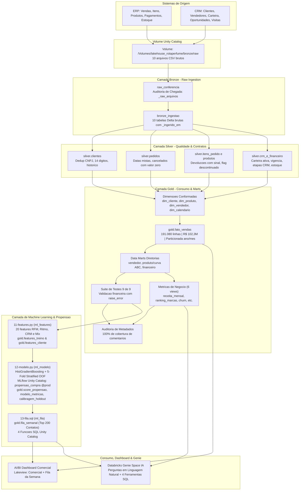

# 🌸 LakeHouse Rota do Perfume — Engenharia de Dados, Machine Learning & Agentes de IA no Databricks

[](https://databricks.com/)
[](https://docs.databricks.com/data-governance/unity-catalog/index.html)
[](https://delta.io/)
[](https://mlflow.org/)
[](https://scikit-learn.org/)
[](https://python.org/)
[](https://docs.astral.sh/uv/)
[-0288D1)](https://docs.databricks.com/dev-tools/bundles/index.html)
[](https://docs.databricks.com/dashboards/index.html)
[-4CAF50)](https://docs.databricks.com/genie/index.html)

> Projeto de engenharia de dados, machine learning e inteligência artificial desenvolvido de ponta a ponta na **Imersão Jornada de Dados**, implementando uma arquitetura **Lakehouse Medallion** moderna no **Databricks** com infraestrutura declarativa via **Databricks Asset Bundles (DAB)**, governança no **Unity Catalog**, modelos de propensão de compra registrados no **MLflow**, dashboards analíticos e assistente de IA em linguagem natural (**Genie Space**).

---

## 📌 1. O Negócio — Rota do Perfume

A **Rota do Perfume** é uma distribuidora B2B brasileira especializada em perfumaria árabe de nicho (importação de casas como *Layali*, *Bayt Al Oud*, *Mizan*, *Zahir* e *Rihan*). Atende canais como perfumarias especializadas, redes de farmácias, quiosques, lojas de departamento e revendedoras autônomas.

### 📊 Números de Referência da Base Histórica (24 Meses: Set/2024 a Ago/2026)
* **Receita Bruta / Líquida Faturada**: **R$ 102.303.828,05**
* **Margem Bruta Total**: **R$ 41.125.619,86** (Margem média de ~40,2%)
* **Base de Clientes Únicos**: **3.000 clientes** ativos no catálogo
* **Volume Transacionado**: **28.729 pedidos** e **197.724 itens de linha**
* **Ticket Médio por Pedido**: **R$ 3.683,67**

### 🧠 Peculiaridades Cruciais do Setor
1. **Sazonalidade Invertida (Reposição Antecipada)**: Por vender no atacado para o varejo, o pico de compras da distribuidora ocorre sempre no **mês anterior** à data comemorativa:
   * **Abril**: Pico de reposição para o *Dia das Mães* (maio).
   * **Junho**: Pico de vendas para o *Dia dos Namorados*.
   * **Outubro**: Pico de abastecimento para a *Black Friday* (novembro).
   * **Dezembro e Janeiro**: Período de **VALE** (comportamento saudável e esperado; o varejo está liquidando estoque).
2. **Impacto Crítico da Ruptura de Estoque**: Em perfumaria de nicho, a falta de um perfume de alta demanda não migra a venda para outro item; a venda simplesmente desaparece.
3. **Disparidade Estratégica de Margens**: *Óleo Concentrado* possui margem alta de **49,9%**, enquanto *Kit Presente* gera grande volume com margem menor de **33,0%**.

---

## 🏛️ 2. Arquitetura Lakehouse Medallion & Camada de ML

Todo o pipeline opera sob o catálogo `lakehouse_rotaperfume` no **Unity Catalog** em ambiente **Databricks Serverless Starter Warehouse**, sem dependência de clusters dedicados. ML é tratado como **mais uma camada integrada do pipeline**, compartilhando o mesmo bundle, auditoria de metadados e governança.



---

## ⚙️ 3. Pipeline de Orquestração Automatizado (15 Tarefas)

O workflow completo é gerenciado pelo Databricks Asset Bundle no job **`rotaperfume_pipeline`**:

| Ordem | Tarefa | Tipo | Depende de | Papel no Pipeline |
|:---:|---|:---:|:---:|---|
| **1** | `raw_conferencia` | Notebook | — | Confere tamanho e contagem de linhas dos 10 CSVs no Volume, gravando `bronze._raw_arquivos`. |
| **2** | `bronze_ingestao` | Notebook | `raw_conferencia` | Ingestão pura dos 10 CSVs em Delta (`inferSchema=false`), validando integridade de linhas. |
| **3** | `silver_clientes` | SQL Task | `bronze_ingestao` | Normalização de CNPJ (14 dígitos), deduplicação por CNPJ e preservação de duplicatas em array. |
| **4** | `silver_pedidos` | SQL Task | `bronze_ingestao` | Resolução de formatos mistos de data (ISO / pt-BR), flags de cancelamento e valor líquido. |
| **5** | `silver_itens_e_produtos` | SQL Task | `bronze_ingestao` | Preservação de devoluções (quantidade negativa) e mapeamento de SKUs descontinuados. |
| **6** | `silver_crm_e_financeiro` | SQL Task | `bronze_ingestao` | Carteira com vendedor desligado (`orfao_vendedor_desligado`), funil de vendas e recálculo de ruptura. |
| **7** | `gold_dimensoes` | SQL Task | `silver_*` (4 tasks) | Criação das dimensões conformadas `dim_cliente`, `dim_produto`, `dim_vendedor` e `dim_calendario`. |
| **8** | `gold_fato_vendas` | SQL Task | `gold_dimensoes` | Tabela fato granular no nível de item de pedido, particionada por `(ano, mes)`. |
| **9** | `gold_marts` | SQL Task | `gold_fato_vendas` | Geração dos data marts para diretoria comercial, de produtos (com Curva ABC) e financeira. |
| **10** | `testes` | SQL Task | `gold_marts` | Execução de 9 testes de integridade financeira e regras de negócio com aborto via `raise_error()`. |
| **11** | `metricas_de_negocio` | SQL Task | `gold_marts` | Criação de 6 views semânticas para consumo direto por BI e agentes de IA. |
| **12** | `auditoria_de_metadado` | SQL Task | `testes`, `metricas_de_negocio` | Validação contra `information_schema` exigindo 100% de documentação em tabelas e colunas. |
| **13** | `ml_features` | Notebook | `testes` | Engenharia de 20 features comportamentais gerando `gold.features_treino` (alvo 7d) e `gold.features_cliente`. |
| **14** | `ml_modelo` | Notebook | `ml_features` | Treino `HistGradientBoosting`, 3 asserts, registro no MLflow UC (`@prod`) e escoragem (`gold.score_propensao`). |
| **15** | `ml_fila` | SQL Task | `ml_modelo` | Geração de `gold.fila_semanal` (200 contatos com motivo e estoque), 4 ferramentas SQL e 3 testes `raise_error`. |

---

## 🔮 4. Ciência de Dados & Machine Learning em Produção

A camada de Machine Learning resolve a pergunta do Diretor Comercial:
> *"Tenho 3.000 clientes. O time consegue ligar para 200 por semana. Quais 200?"*

### A. Engenharia de Features (20 Variáveis em 4 Grupos)
Calculadas a partir de uma única função `montar_features(referencia)` com corte temporal estrito `< referencia` para **eliminar data leakage**:
* **RFM (6)**: `recencia_dias`, `frequencia_pedidos`, `valor_total`, `ticket_medio`, `margem_total`, `margem_percentual`.
* **Ritmo (4)**: `intervalo_medio_dias`, `desvio_intervalo_dias`, `atraso_relativo` (com proteção para clientes de 1 pedido), `pedidos_ultimos_90d`.
* **CRM (5)**: `oportunidades_abertas`, `oportunidades_ganhas`, `taxa_ganho`, `visitas_90d`, `conversao_visita`.
* **Mix (5)**: `skus_distintos`, `categorias_distintas`, `marcas_distintas`, `concentracao_marca_top`, `comprou_lancamento`.

### B. Treinamento & Validação do Modelo
* **Algoritmo**: `HistGradientBoostingClassifier(random_state=42)` do scikit-learn (tratamento nativo de NaNs e sem problemas de compatibilidade com MLflow no Serverless).
* **Validação Cruzada Out-of-Fold (5 Folds)**: Mede a métrica de negócio **`lift_top200`** e **`acertos_top200`** contra a taxa base de **10,1%**.
* **3 Asserts que Interrompem o Pipeline em Caso de Falha**:
  1. Ganho de AUC sobre o melhor baseline heurístico >= **+0,05**.
  2. AUC < **0,99** (proteção contra data leakage).
  3. `lift_top200` >= **2,5x** (viabilidade econômica do esforço comercial).
* **Registro no Unity Catalog**: `lakehouse_rotaperfume.gold.propensao_compra` com alias `@prod` e inferência de assinatura.

### C. A Fila Semanal & 4 Ferramentas no Unity Catalog
* **`gold.fila_semanal`**: 200 clientes com maior propensão entre vendedores ativos, ordenados por vendedor, com `motivo` explicativo dinâmico e `sugestao` de recompra com consulta ao snapshot mais recente de estoque.
* **4 Funções SQL de Ferramentas para Agentes de IA**:
  1. `gold.priorizar_carteira(p_vendedor, p_quantos)`: Fatia da fila do vendedor.
  2. `gold.contexto_cliente(p_cliente_id)`: Perfil consolidado e marcas favoritas.
  3. `gold.sugerir_produtos(p_cliente_id)`: SKUs favoritos parados há mais de 90 dias.
  4. `gold.checar_disponibilidade(p_sku)`: Saldo e flag de ruptura no estoque.

---

## 🛡️ 5. Governança, Qualidade e Contratos de Dados

### A. Contratos Formais na Camada Silver (`CHECK` Constraints)
* `silver.clientes`: `length(cnpj) = 14` e `data_cadastro IS NOT NULL`
* `silver.pedidos`: `data_pedido IS NOT NULL` e `NOT cancelado OR valor_liquido = 0`
* `silver.itens_pedido`: `quantidade_abs > 0`

### B. Suíte de 12 Testes Automatizados no Pipeline (raise_error)
* **9 Testes na Gold**: Reconciliação exata de receita (R$ 102,3M), unicidade de CNPJ, completude temporal, tratamento de devoluções, contagem de linhas e integridade referencial.
* **3 Testes na Fila de ML**: Exatamente 200 linhas, zero motivos vazios/nulos e scores estritamente no intervalo [0, 1].

### C. Auditoria de Metadados para IA
* Consulta automatizada ao `information_schema`.
* **100% de cobertura de comentários** em todas as tabelas, views, colunas e funções do catálogo.

---

## 🤖 6. Camada de Consumo: Dashboard & IA como Código

### 📊 Dashboard Comercial (Databricks AI/BI Lakeview)
Versionado em [`rotaperfume/resources/dashboard-comercial.lvdash.json`](rotaperfume/resources/dashboard-comercial.lvdash.json):
* **Página 1 (Comercial)**: KPIs globais (Receita R$ 102,3M, Margem R$ 41,1M), Sazonalidade 24 meses, Ranking de Marcas, Margem por Categoria e Top Clientes.
* **Página 2 (Fila da semana)**: Visualização operacional da lista priorizada de 200 ligações com dropdown por **Vendedor**, exibindo ordem, cliente, nota, faixa, motivo dinâmico e sugestão de oferta com estoque.

🔗 **[Acessar Dashboard Publicado](https://dbc-61d9738c-00ad.cloud.databricks.com/dashboardsv3/01f1a19de456132680fd58ff4302a5c2/published?w=111196643652189)**

---

### 🧠 Databricks Genie Space (Assistente de IA em Linguagem Natural)
Versionado em [`rotaperfume/resources/comercial.geniespace.json`](rotaperfume/resources/comercial.geniespace.json) e [`rotaperfume/resources/genie.genie_space.yml`](rotaperfume/resources/genie.genie_space.yml):
* **Contexto de Negócio Embutido**: Regras de cálculo, sazonalidade antecipada, catálogo semântico e tabelas de ML (`fila_semanal` e `score_propensao`).
* **Instrução de Ouro**: *"Use sempre as tabelas e funções deste espaço. Nunca invente número, nome de cliente ou quantidade de estoque."*

🔗 **[Acessar Genie Space de IA](https://dbc-61d9738c-00ad.cloud.databricks.com/genie/rooms/01f1a19fc09b1d0e8618ce1425f7dffc?w=111196643652189)**

---

## 📂 7. Estrutura do Repositório

```
LakeHousePerfumes/
├── .llm/                                # Prompts guiados e contextos de imersão
│   ├── contexto_aula3.md
│   ├── ml_prompt01.md
│   ├── ml_prompt02.md
│   └── ml_prompt03.md
├── dados/                               # Datasets brutos gerados com seed 42
│   ├── crm/                             # CSVs: clientes, vendedores, carteira, oportunidades, visitas
│   └── erp/                             # CSVs: produtos, pedidos, itens_pedido, pagamentos, estoque
├── rotaperfume/                         # Databricks Asset Bundle (DAB)
│   ├── databricks.yml                   # Configuração global do Bundle e targets (dev/prod)
│   ├── resources/                       # Recursos declarativos como código
│   │   ├── catalogo.yml                 # Schemas (bronze/silver/gold) e Volume (bronze.raw)
│   │   ├── pipeline.job.yml             # Workflow DAG com as 15 tarefas
│   │   ├── dashboard.dashboard.yml      # Recurso do Dashboard Lakeview
│   │   ├── dashboard-comercial.lvdash.json # Definição visual do Lakeview Dashboard (2 páginas)
│   │   ├── genie.genie_space.yml        # Recurso do Genie Space (IA)
│   │   └── comercial.geniespace.json    # Configuração e instruções do Genie Space
│   ├── src/                             # Código-fonte das transformações
│   │   ├── raw/                         # Conferência de arquivos
│   │   ├── bronze/                      # Ingestão crua para Delta
│   │   ├── silver/                      # Limpeza, contratos e tipagem (01 a 04)
│   │   ├── gold/                        # Dimensões, fato, marts, testes e auditoria (05 a 10)
│   │   └── ml/                          # Camada de Machine Learning & Agentes (11 a 13)
│   │       ├── features_lib.py          # Lib pura: 20 features e validações
│   │       ├── 11-features.py           # Notebook: geração de features_treino e features_cliente
│   │       ├── modelo_lib.py            # Lib pura: baselines, lift, calibragem e asserts
│   │       ├── 12-modelo.py             # Notebook: treino, MLflow UC @prod, escoragem e métricas
│   │       └── 13-fila.sql              # SQL: fila_semanal, 4 funções UC e 3 testes
│   ├── scripts/                         # Scripts bash para deploy e automação
│   │   ├── criar-catalogo.sh
│   │   ├── subir-raw.sh
│   │   └── rodar-tarefa.sh              # Execução isolada de tarefas (ex: rodar-tarefa.sh Emerson ml_fila)
│   ├── tests_unit/                      # 22 testes unitários locais com pytest (sem cluster)
│   │   ├── test_conferencia_lib.py
│   │   ├── test_ingestao_lib.py
│   │   ├── test_features_lib.py
│   │   └── test_modelo_lib.py
│   └── pyproject.toml                   # Dependências do projeto gerenciadas via uv (Python 3.12)
```

---

## 🚀 8. Como Reproduzir e Executar o Projeto

### Pré-requisitos
* Python 3.12 (evite Python 3.13)
* [uv](https://docs.astral.sh/uv/) instalado
* [Databricks CLI](https://docs.databricks.com/dev-tools/cli/databricks-cli.html) (versão 0.205+)
* Conta no Databricks (Databricks Free Edition ou Workspace corporativo)

### Passo a Passo

1. **Clonar o Repositório e Configurar o Ambiente**:
   ```bash
   git clone https://github.com/oemeferreira/LakeHousePerfumes.git
   cd LakeHousePerfumes/rotaperfume
   uv sync --dev
   ```

2. **Autenticar na Databricks CLI**:
   ```bash
   databricks auth login --host https://SEU-WORKSPACE.cloud.databricks.com
   ```

3. **Criar o Catálogo e Subir os Dados Brutos**:
   ```bash
   bash scripts/criar-catalogo.sh Emerson
   bash scripts/subir-raw.sh Emerson
   ```

4. **Validar e Fazer o Deploy do Bundle**:
   ```bash
   databricks bundle validate --target dev --profile Emerson --strict
   databricks bundle deploy --target dev --profile Emerson
   ```

5. **Executar o Pipeline Completo ou Tarefas Específicas**:
   ```bash
   # Executar todas as 15 tarefas:
   databricks bundle run rotaperfume_pipeline --target dev --profile Emerson

   # Ou executar uma tarefa isolada:
   bash scripts/rodar-tarefa.sh Emerson ml_fila
   ```

6. **Rodar os Testes Unitários Locais**:
   ```bash
   uv run pytest tests_unit/ --basetemp=./.pytest_tmp
   ```

---

## 👨‍💻 Autor

Desenvolvido por **Emerson Ferreira** no contexto da **Imersão Jornada de Dados + IA**.